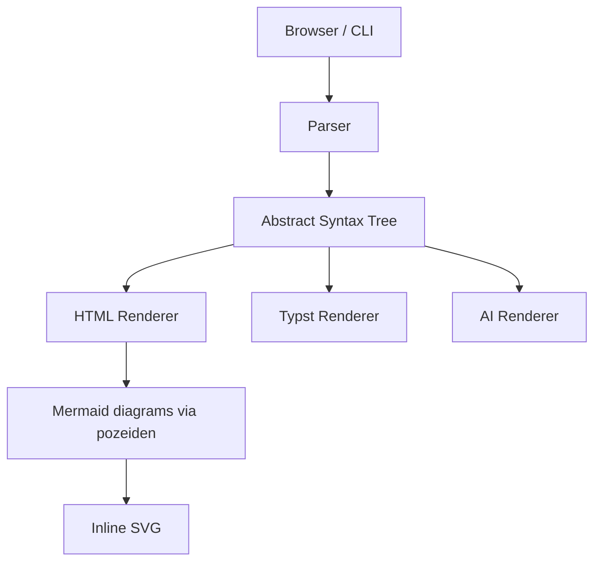
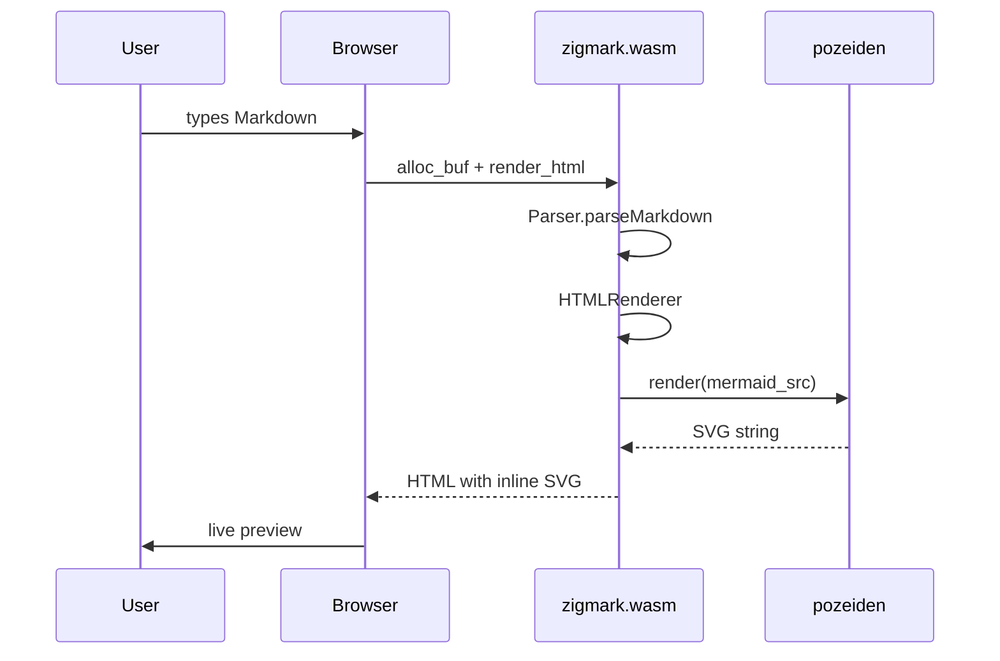
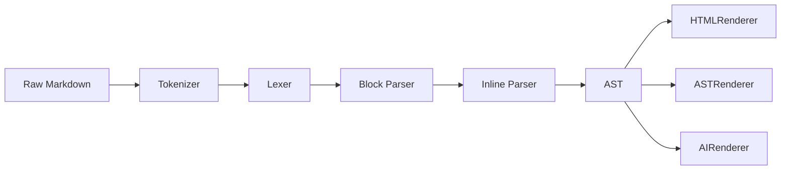
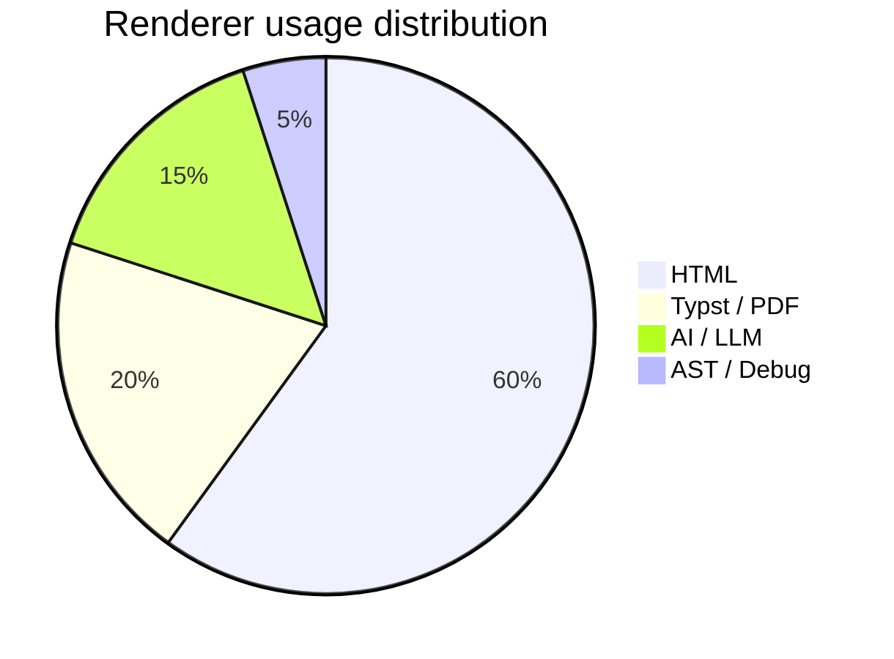
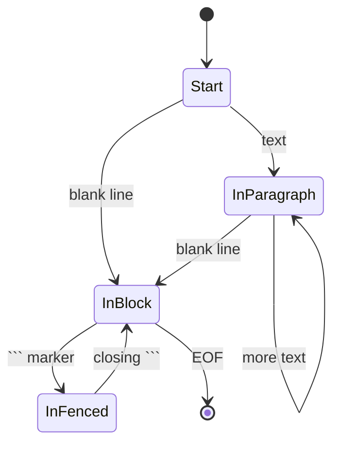
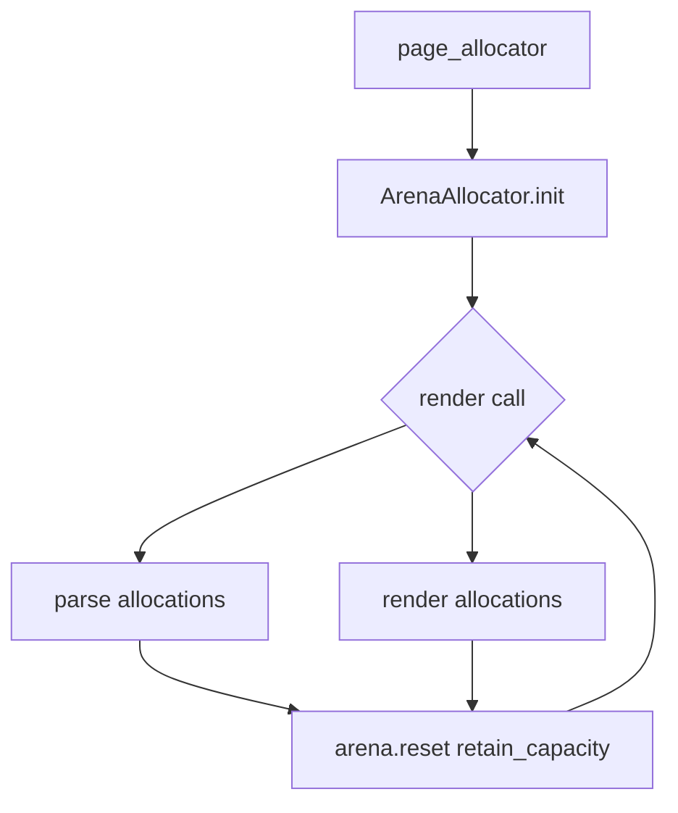

# Architecture Overview

This document contains representative mermaid diagrams for benchmark purposes.
It measures how parsers handle fenced code blocks with diagram content.

## System Architecture



## Request Lifecycle



## Parsing Pipeline



## Renderer Output Formats



## State Machine: Parser States



## Memory Management



## GFM Tables (non-diagram content for balance)

| Renderer   | Output      | Mermaid | Speed   |
| ---------- | ----------- | ------- | ------- |
| HTML       | `.html`     | yes     | fast    |
| Typst      | `.typ`      | no      | fast    |
| AI         | plain text  | no      | fastest |
| AST        | tree        | no      | fast    |

## Task list

- [x] CommonMark 652/652 tests
- [x] GFM extensions
- [x] Mermaid via pozeiden
- [x] WASM target
- [ ] SIMD optimisation

## Code (non-diagram fenced block)

```zig
const Parser = zigmark.Parser.init();
const doc = try parser.parseMarkdown(alloc, markdown);
defer doc.deinit(alloc);
const html = try zigmark.HTMLRenderer.render(alloc, doc);
```

---

_Benchmark input — contains 6 mermaid blocks and representative GFM content._
